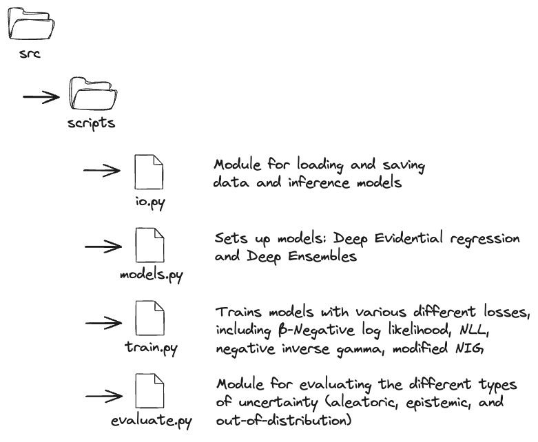
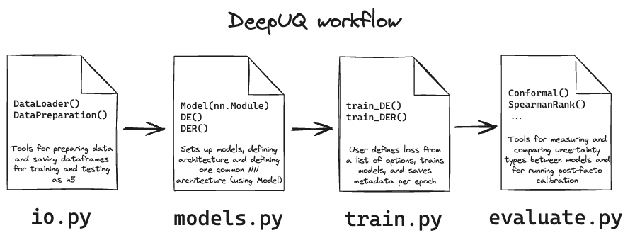

# DeepUQ
DeepUQ is a package for injecting and measuring different types of uncertainty in ML models.

(arxiv link if applicable)

(pypi link if applicable)

(MIT or Apache 2.0 or another requires link changed)

## Workflow

Getting a little more specific:

These modules can be accessed via the ipython example notebooks or via the model modules (ie `DeepEnsemble.py`). For example, to ingest data and train a Deep Ensemble: 
> cd src/scripts/

> python DeepEnsemble.py low 10 /Users/rnevin/Documents/DeepUQ/ --save_final_checkpoints=True --savefig=True --n_epochs=10

This command will train a 10 network, 10 epoch ensemble on the low noise data and will save figures and final checkpoints to the specified directory. For more information on the arguments:
> python DeepEnsemble.py --help

## Installation 

### Clone this repo
First, cd to where you'd like to put this repo and type:
> git clone https://github.com/deepskies/DeepUQ.git

Then, cd into the repo:
> cd DeepUQ

### Install and use poetry to set up the environment
Poetry is our recommended method of handling a package environment as publishing and building is handled by a toml file that handles all possibly conflicting dependencies. 
Full docs can be found [here](https://python-poetry.org/docs/basic-usage/).

Install instructions: 

Add poetry to your python install 
> pip install poetry

Then, from within the DeepUQ repo, run the following:

Install the pyproject file
> poetry install 

Begin the environment
> poetry shell

### Verify it is installed

After following the installation instructions, verify installation is functional is all tests are passing by running the following in the root directory:
> pytest